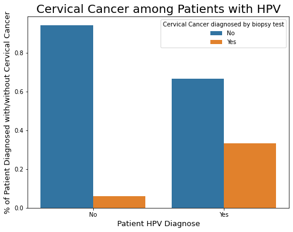
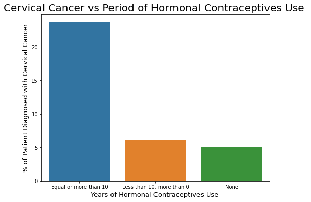

# Cervical Cancer Risk

By **Paula Pipkin** 

### Evaluating Cervical Cancer Risk :

This dataset focuses on the prediction of indicators/diagnosis of cervical cancer. 
The features cover demographic information, habits, and historic medical records.

### Data:

The data set source is the website UCI Machine Learning Repository and here is a link to the original data:
[https://datahack.analyticsvidhya.com/contest/practice-problem-big-mart-sales-iii/](https://archive.ics.uci.edu/ml/datasets/Cervical+cancer+%28Risk+Factors%29#)

## Methods

- After some pre cleaning, two copies of the data were made so EDA could be done without risking leakage.  
- EDA was used to show correlations between some relevant features
- X models were applied, Linear Regression, Decision Tree and Random Forrest

## Results

#### Cervical Cancer among Patients with HPV

> Out of 835 patients, 1/3 or 33% of those patients diagnosed with HPV were also diagnosed with cervical cancer, only 5% of those without HPV were diagnosed with Cervical Cancer.

"Virtually all cervical cancers are caused by HPV. Routine screening can prevent most cervical cancers by allowing health care providers to find and remove precancerous cells before they develop into cancer." (source: https://www.cancer.gov/about-cancer/causes-prevention/risk/infectious-agents#hpv).

#### Cervical Cancer vs Period of Hormonal Contraceptives Use

> The longer a woman uses oral contraceptives, the greater the increase in her risk of cervical cancer. One study found a 10% increased risk for less than 5 years of use, a 60% increased risk with 5–9 years of use, and a doubling of the risk with 10 or more years of use (source: https://www.cancer.gov/about-cancer/causes-prevention/risk/hormones/oral-contraceptives-fact-sheet)

In our sample, 18% more women were diagnosed with Cervical Cancer among those patients using Hormonal Contraceptive for longer than 10 years.

#### Showing metrics for testing data:

| Model         | RMSE                   | R2       |
| ------------- | -----------------------| -------- |
| Linear Regression | 30002	 | 000 |
| Decision Tree |000             | 0006  |
| Random Forrest|000	|000	

## Recommendations, Limitations & Next Steps:

- *not yet* 

- *not yet*  

### For further information

For any additional questions, please contact **paulareche@gmail.com**
